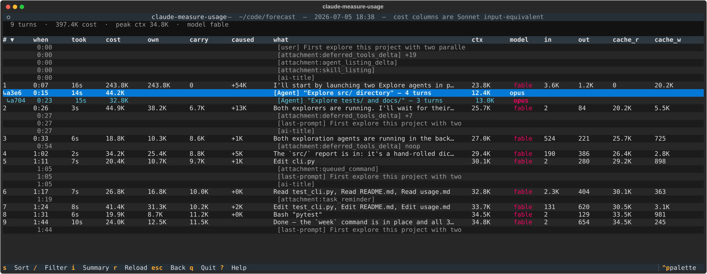

# claude-measure-usage

A read-only debugger over the [Claude
Code](https://docs.anthropic.com/en/docs/claude-code) session transcripts
in `~/.claude/projects/`. It answers the question *"where did all those
tokens go?"* — across projects, across sessions within a project, across
turns within a session, and down into every spawned subagent, recursively.

It has three front-ends over one analysis engine:

- a **Python library**, for scripting your own analysis;
- an **interactive terminal UI**, built with
  [Textual](https://textual.textualize.io/);
- a **`/measure-usage` slash command**, for checking usage from inside a
  live Claude Code session.

Requires Python 3.10+.

## Install

```bash
pip install claude-measure-usage[tui]
```

That gets you both the library and the `claude-measure-usage` command
that launches the TUI. If the TUI is all you want, an isolated tool
install keeps it out of your project's dependencies:

```bash
uv tool install claude-measure-usage[tui]
```

Drop the `[tui]` extra to install the library alone, without the
dependencies that only the TUI needs — the right choice when you depend
on `claude-measure-usage` from another package and only import it.

The slash command installs separately, [as a
plugin](#the-measure-usage-slash-command).

> To track unreleased changes, install from a git checkout instead:
> `uv tool install "claude-measure-usage[tui] @
> git+https://github.com/zytedata/claude-measure-usage"`, or `uv tool
> install --editable "/path/to/claude-measure-usage[tui]"` for
> development.

## The library

```python
from claude_measure_usage import (
    compute_metrics,
    find_transcript_path,
    format_metrics,
)

path = find_transcript_path("e75ec368-…", cwd="/path/to/project")
metrics = compute_metrics(path, start_ts=0)  # 0 = the whole session

print(metrics["total_tokens"])  # raw count, subagents included
print(format_metrics(metrics))  # the same summary the slash command prints
```

`parse_transcript` and `build_agent_tree` give you the raw per-turn rows and
the subagent tree if you want to compute something `compute_metrics` doesn't.

## The TUI



This is the **session detail** screen — the heart of the app: one row
per assistant turn, with a cost decomposition per turn. The dimmed `↳`
rows under turn 1 are subagents — here, two parallel Explore agents
that ran on a different model than the main session; `↵` on one drills
into its own per-turn table. The columns right of `what` hold the raw
transcript counts (`model`, `in`, `out`, `cache_r`, `cache_w`) —
exactly what the API reported, unnormalized. One exception: on rows
marked `≈`, the transcript never recorded the turn's final usage, so
`out` is estimated from content length. On narrow terminals the
table scrolls horizontally with `←`/`→`.

Three kinds of rows share the table:

- **Turn rows** — one per assistant turn. `↵` opens the turn detail
  modal: full text preview, tool calls with their inputs, raw token
  counts, and the rigorous `own = self + subagents` breakdown.
- **Subagent rows** — dimmed `↳id` footnotes under the turn that
  spawned them, one row per subagent regardless of its internal size.
  `↵` drills into a full session-detail screen for that subagent;
  nesting can go arbitrarily deep, `esc` always pops one level.
- **Non-turn rows** — user messages, attachments, slash commands,
  compact boundaries, permission-mode changes. `↵` opens a payload
  modal with the full, untruncated content.

Two picker screens lead here — the whole app is a stack (projects →
sessions → session detail → modals) where `↵` drills in and `esc`
always backs out one level:

**Projects** — every project directory under `~/.claude/projects/`, with
session count and last activity. The cursor starts on the project matching
your current working directory.

**Sessions** — every transcript in the selected project: start time, turn
count, token usage, peak context, model, and a first-user-message summary.
Transcripts parse in a background worker with a progress bar, so big
projects stay responsive while loading.

### Keys

| Key | Action |
|---|---|
| `↵` | Open detail modal; on a `↳` subagent row, drill into it |
| `esc` | Back one level (modal → table → sessions → projects) |
| `s` | Cycle sort (natural → took → cost → own → carry → caused); clicking a column header also sorts |
| `/` | Filter rows by substring on the `what` column |
| `i` | Session summary overlay (totals, per-tool cost, agent tree) |
| `r` | Reload from disk |
| `q` | Quit |
| `?` | Help with the current screen's bindings |

Sort is *glued*: subagent footnotes always stay attached below their
spawning turn, and non-turn rows keep their natural transcript position.
Filtering never orphans context — a matching subagent brings its parent
turn along, and vice versa.

## Reading the numbers

### Sonnet input-equivalent

Raw token counts are hard to compare — 100K cache-read tokens cost 10x
less than 100K output tokens, and the same tokens on Opus cost 5x more
than on Sonnet. All cost columns in the TUI use **Sonnet
input-equivalent**: a single normalized unit that accounts for both
token type and model, so everything can be compared and summed directly.

Token type multipliers (from the ratio of per-type prices to the input
price, consistent across Claude models):

| Type | Multiplier |
|------|-----------|
| Cache read | 0.1x |
| Input | 1x |
| Cache write (5m) | 1.25x |
| Cache write (1h) | 2x |
| Output | 5x |

Model scaling (each model's input price relative to Sonnet's $3/M):

| Model | Scale | Input price |
|-------|-------|-------------|
| Haiku | 0.33x | $1/M |
| Sonnet | 1x | $3/M |
| Opus | 1.67x | $5/M |
| Fable / Mythos | 3.33x | $10/M |

So 1000 output tokens on Opus = 1000 × 5 × 1.67 = 8,350 Sonnet
input-equivalent tokens. Legacy models (Opus 4.1 and earlier, Haiku 3.5
and earlier) are supported at their original prices.

### `cost = own + carry`, and `caused`

Each turn's cost decomposes into parts you can act on differently:

- **own** — what this turn *produced*: model output, tool results it
  wrote to the cache, plus the rollup of any subagents it spawned. This
  is the part you can shrink by making the turn leaner.
- **carry** — what this turn *paid to read* inherited context
  (`cache_r × 0.1 × model_scale`). Determined mostly by earlier turns —
  shrink it by trimming upstream bloat.
- **caused** — a projection, not a cost already paid: what subsequent
  turns in the same compaction epoch will collectively pay to re-read
  this turn's cache contribution. Always rendered with a leading `+`.

The first turn of each session is tagged `(startup)`: its numbers
include session bootstrap overhead (system prompt, tool schemas,
CLAUDE.md, initial skill loads) that isn't purely developer-actionable.

### Subagent accounting

A parent turn's `cost` and `own` **include** the subtree rollup of the
subagents it spawned — so sorting by cost bubbles up turns that were
expensive *because of* their subagents. The dimmed `↳` footnote rows
show each subagent's individual contribution for visual accounting, but
that amount is already counted in the parent; the totals row sums turn
rows only, so the table total reconciles with the session total.

Parent-child links are inferred from the transcripts: an Agent or Skill
tool call followed within a small time window by a new subagent
transcript starting is linked as parent and child.

### Tool cost estimates

The summary overlay (`i`) includes a per-tool cost table. These are
estimates computed from text length (~4 chars per token), not exact
measurements:

- **invoke** — one-time cost of the call:
  `(output_tokens × 5 + input_tokens) × model_scale`.
- **carry** — the result sitting in context for every later turn until
  the session ends or a `/compact` boundary replaces it:
  `input_tokens × 0.1 × model_scale × remaining_turns_in_epoch`.

Use them for relative comparisons (which tools are expensive?) rather
than absolute numbers.

## The `/measure-usage` slash command

The same analysis engine also ships as a Claude Code plugin, so you can
check usage from inside a live session without leaving it:

```bash
claude plugin marketplace add zytedata/claude-measure-usage
claude plugin install measure-usage
```

Then, in a session:

- `/measure-usage` — full session stats (duration, token breakdown,
  peak context, per-tool costs, agent tree). Same output as the TUI's
  `i` summary overlay.
- `/measure-usage turns` — per-turn tables in text form: the TUI's
  session-detail view, flattened, with one table per subagent.
- `/measure-usage start` / `stats` / `stop` — track a specific span of
  the session instead of the whole thing.

For development, load the plugin directly so changes take effect
immediately:

```bash
claude --plugin-dir /path/to/claude-measure-usage/plugins/measure-usage
```

## Running the tests

One command runs the suite on every supported Python (3.10–3.14);
[tox-uv](https://github.com/tox-dev/tox-uv) provisions the
environments through uv, fetching any missing interpreter:

```bash
uvx --with tox-uv tox
```

For quick iteration on a single Python:

```bash
uv run --extra dev pytest
```

CI runs the same tox environments on every pull request.
